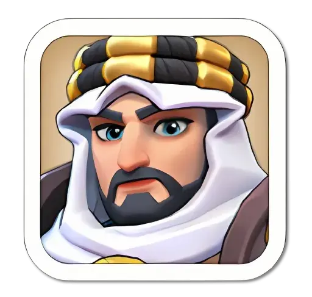
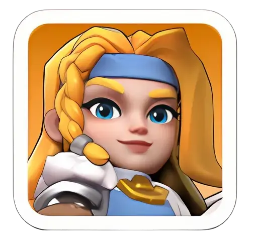
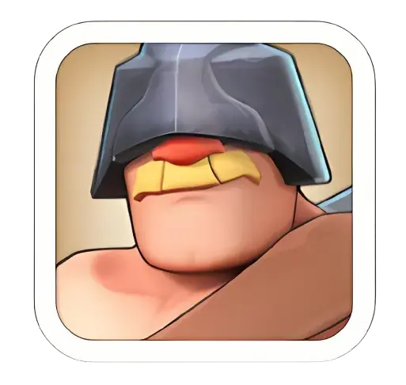
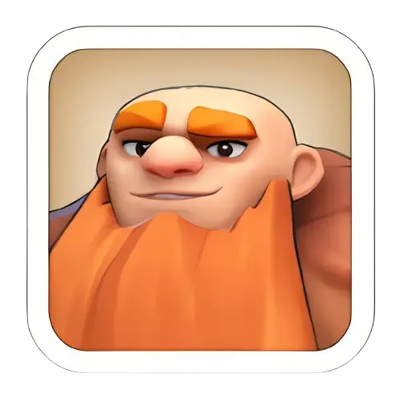

## Bear Trap — hero setup

Slots 2 and 3 do nothing except carry troops. Put your
highest-level heroes there — level means more troops, and
their skills are ignored.

### Setup Example 1

| Slot 1 — Lead | Slot 2 | Slot 3 |
|---|---|---|
| **Only this hero's skill applies** | Capacity only | Capacity only |
| **Chenko**  | **Fahd**  | **Jabel**  |

### Setup Example 2

| Slot 1 — Lead | Slot 2 | Slot 3 |
|---|---|---|
| **Only this hero's skill applies** | Capacity only | Capacity only |
| **Amane**  | **Helga**  | **Gordon**  |

### Setup Example 3

| Slot 1 — Lead | Slot 2 | Slot 3 |
|---|---|---|
| **Only this hero's skill applies** | Capacity only | Capacity only |
| **Yeonwoo**  | **Edwin**  | **Forest**  |

### Setup Example 4 — Troops Only, No Hero
| Slot 1 — Lead | Slot 2 | Slot 3 |
|---|---|---|
| **No skill — troops only** | Capacity only | Capacity only |
| *(no hero assigned)* | *(no hero assigned)* | *(no hero assigned)* |
