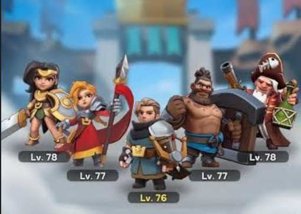
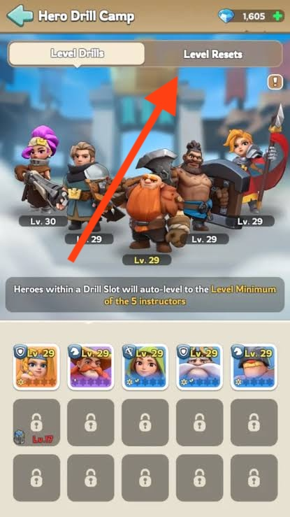

# Drill Camp — Full Guide

If you didn't know about Drill Camp until now, you're going to love this.

When you're new, deciding which heroes to invest in, is overwhelming. Many governors make the mistake of spreading Hero EXP evenly across every hero they pull — which could make progress even slower!

Drill Camp fixes exactly that. Once unlocked, your **5 highest-level heroes** automatically become your **Drill Instructors**. Any other hero you place into a **Drill Slot** instantly matches the **lowest-leveled instructor's level** — for **zero Hero EXP**.

That means you only need to keep investing EXP in those top 5. Every other hero you slot in rides along for free. 

---

## Requirements

- **Town Center level 13** — this is when Drill Camp unlocks.

---

## How It Actually Works

### Drill Instructors are automatic, not chosen
There's no menu where you hand-pick your 5 trainers. Whichever 5 heroes currently have the **highest levels** on your roster automatically become the Drill Instructors.

### Drill Slots sync to the lowest instructor
Any hero placed into a Drill Slot immediately jumps to match your **lowest-leveled instructor** — not the average, the [red]*lowest*.[/red] which you can notice it in the middle of the 5 heroes.

**Example:** If your 5 instructors are level 80, 78, 82, 79, and 30 — every hero in a Drill Slot becomes level 30. One weak instructor drags the whole system down.

**Takeaway:** Level your 5 instructors as evenly as possible. An uneven top 5 wastes the free leveling potential for your whole secondary roster.

### Heroes in a Drill Slot can't be leveled manually
Heroes sitting in a Drill Slot cannot be leveled up manually. They can still gain **Stars** and **Skill upgrades** while slotted — just not levels.

### Removing a hero from a Drill Slot
If you pull a hero back out of a Drill Slot, they revert to whatever level they'd actually earned from their own invested EXP before being slotted — not to level 1.

### The 24-hour lock
Once a hero exits a Drill Slot, that slot stays **locked for 24 hours** before it can be used again. Plan hero swaps with this in mind — don't reshuffle right before you need a slot free.

---

## The Level Resets Tab — Reclaiming EXP

The **Level Resets** tab lets you reset a hero's level back to 1 and get all the Hero EXP you spent on them refunded to your inventory.

So to swap in a hero you *want* as an instructor, either:
- Level that hero up until they outrank your current 5th-highest instructor, or
- Reset your weakest current instructor to open the spot, then reinvest EXP into the hero you want instead.

---

## First-Time Workflow

1. In **Level Resets**, reset every hero you'd previously leveled that isn't in your top 5.
3. Reinvest all that refunded EXP into your 5 instructors, leveling them as evenly as possible.
4. Place your other heroes into the open Drill Slots — they'll jump straight to your lowest instructor's level, free.

---

## When to Do This Relative to KvK

Do this **well before KvK — not the week of.**

Reasons:
- Reshuffling instructors and resetting heroes takes real EXP reinvestment time to get your top 5 leveled evenly again.
- The **24-hour Drill Slot lock** after removing a hero means last-minute swaps can leave a slot dead right when you need it.
- You want your Drill Slot heroes (used as secondary marches, gathering, garrison, or rally joiners) stable and settled before KvK prep starts — not mid-shuffle.

---

## Caution: Rally Joiners

If you use a Drill Slot hero as a rally joiner, double-check their actual skill level before sending. A low-tier hero artificially leveled up via Drill Camp can still have weak/low skills, and can override the properly-leveled skill of another player's DamageUp hero in the same rally — hurting the whole rally's output. Level ≠ skill rank.

---

