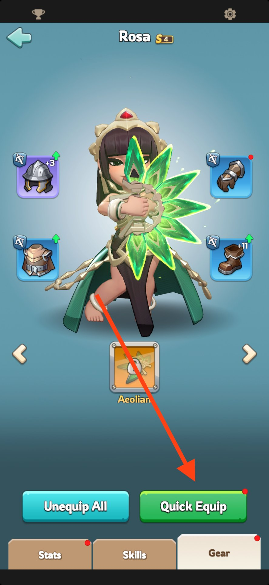
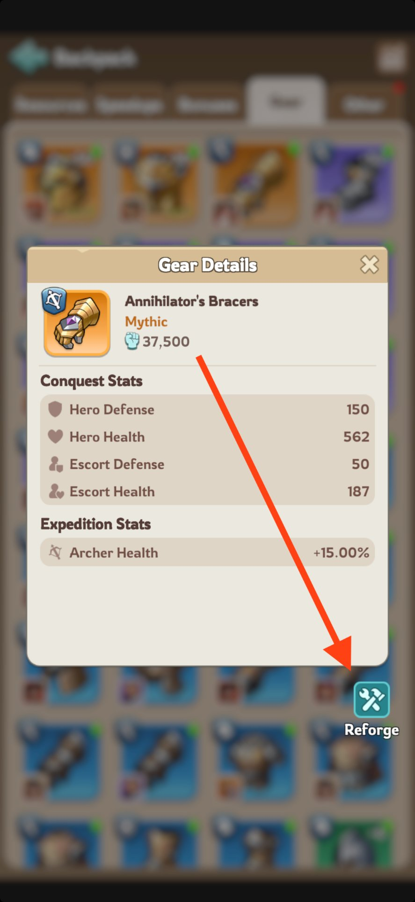
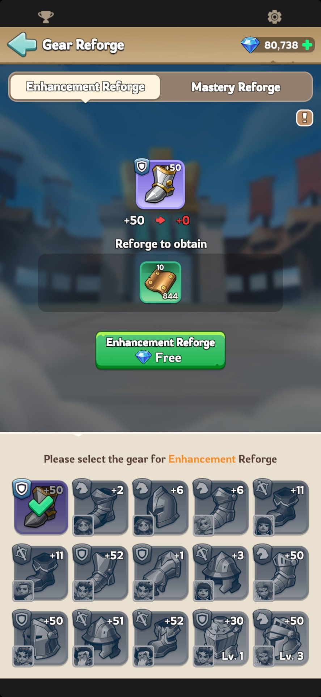
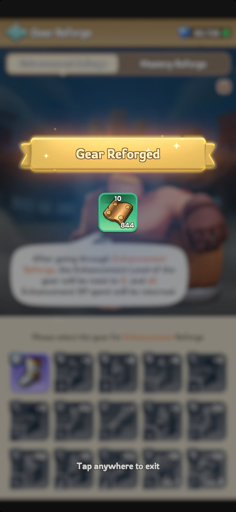

# Resetting Hero Gear (Enhancement) — How It Works & What to Prioritize

Hero Gear has **two separate progression tracks**: Enhancement and Mastery. This guide covers **Enhancement Reforge** only — the track that raises a gear piece's base Level. For Mastery Reforge, see the separate Mastery Reforge guide.

## How to Reforge (Step by Step)

**1. Unequip the gear piece** — it must not be on an active hero.

**2. Go to your backpack → Gear → select the gear piece → tap Reforge.**
  

**3. Confirm the preview** — it should show 100% of your invested Enhancement XP being returned.

**4. The piece's Enhancement Level drops to 0; the XP goes back to your inventory.** You can now invest that XP into your desired hero's gear.

---

## Cooldown

- Each piece gets **one free reforge every 24 hours**.
- Need to reforge again before the cooldown resets? It costs **100 gems** to bypass — this only removes the cooldown, it doesn't change the refund itself.

## What to Prioritize When Reinvesting

The point of reforging isn't to reset everything — it's to **reclaim XP sitting on gear you no longer need** and redirect it toward your actual priority pieces.

### 1. Reforge gear on heroes you've stopped using
If you invested Enhancement XP into a hero who's since been replaced by a newer generation, or who you built before understanding the Rally Host vs. Joiner vs. Garrison roles, reforge that gear first. This is close to free — full XP refund, only a 24-hour cooldown to work around (or 100 gems to skip it).

### 2. Reinvest into your top 3 (Main March) heroes only
Don't spread the reclaimed XP. Identify the 3 heroes you actually lead fights with, and follow this priority order when reinvesting:

**Infantry Health → Archer Lethality → Cavalry Lethality**

| Priority | Piece | Troop | Key Stat |
|---|---|---|---|
| 1st | Gloves | Infantry | Health / Defence |
| 2nd | Helmet | Archer | Lethality / Attack |
| 3rd | Helmet | Cavalry | Lethality / Attack |
| 4th | Chest | Infantry | Health / Attack |
| 5th | Boots | Archer | Lethality / Defence |
| 6th | Boots | Cavalry | Lethality / Defence |