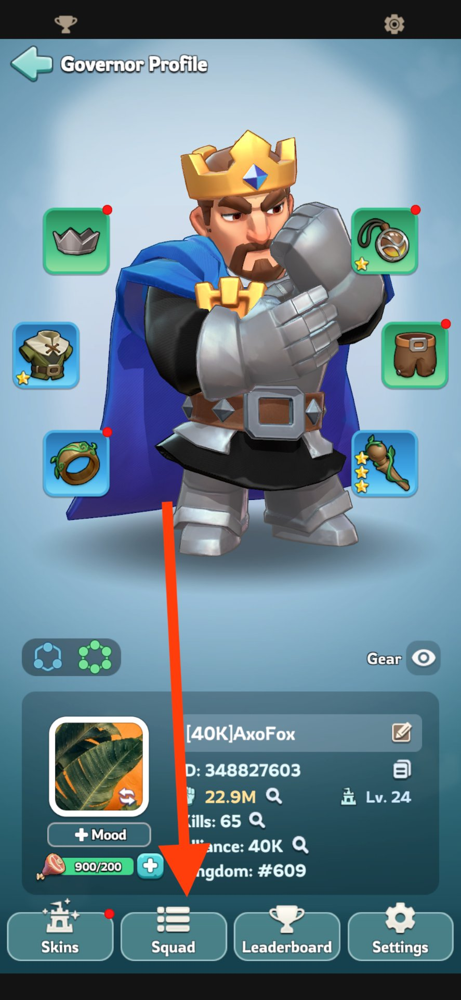
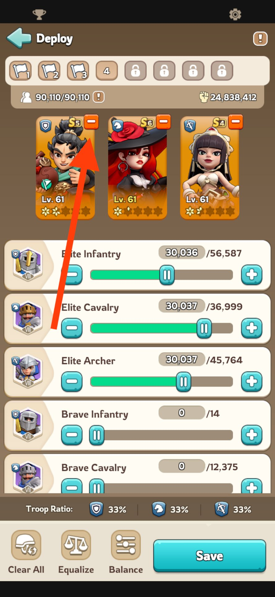
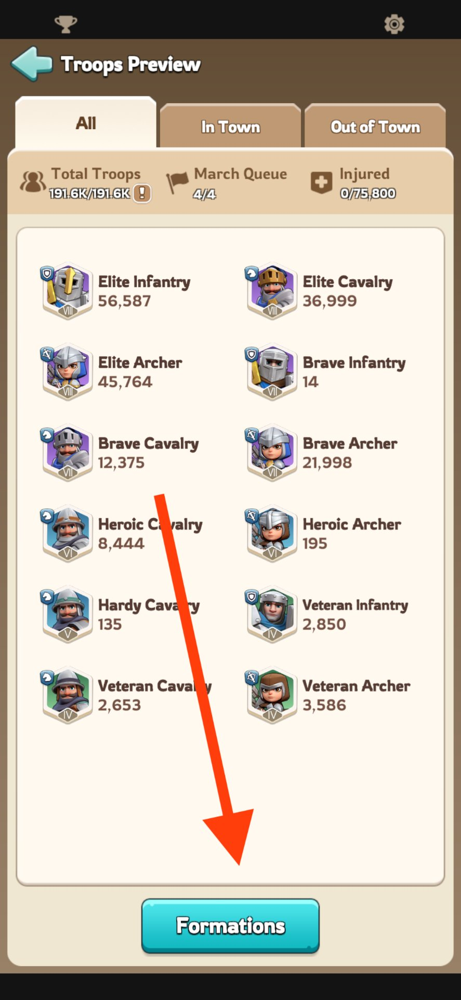
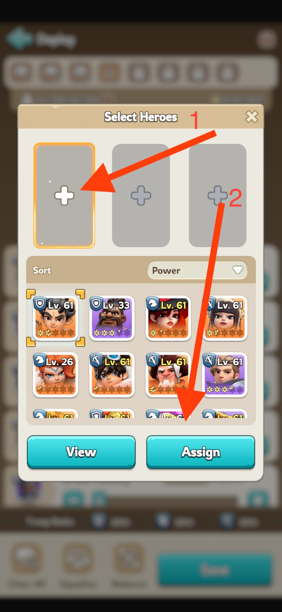
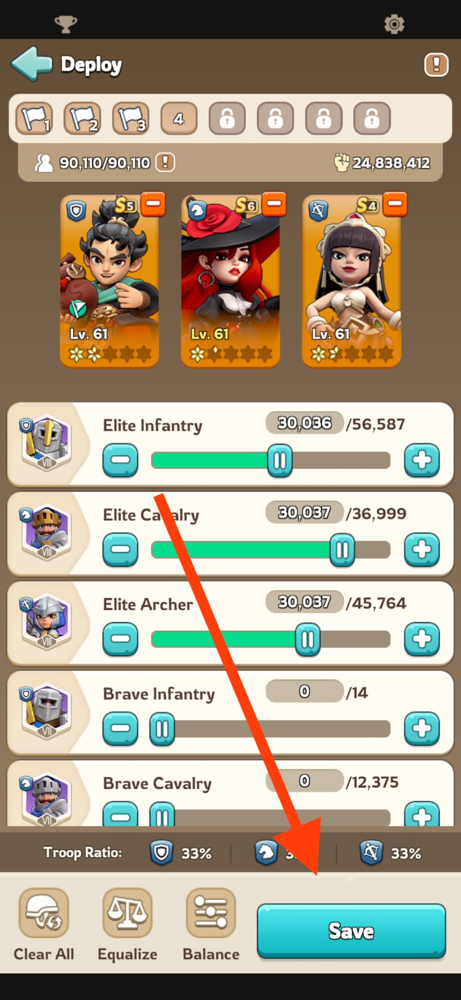
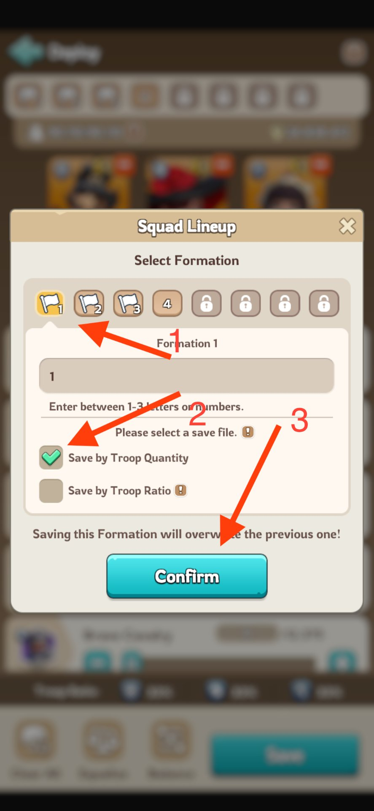
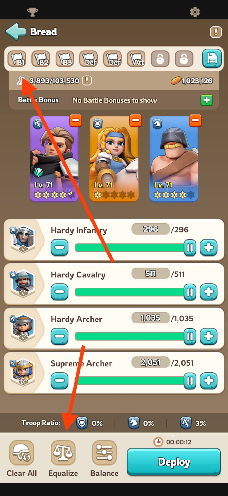

# How to preset your heroes

Set this up once. After that, switching your whole squad takes one tap.

**1. Tap your profile picture (top left), then Squad**

**2. Clear the slots**

Remove all heroes first — you can't overwrite a slot directly.

 

**3. Add the heroes you want**

**4. Save the preset**

 

---

## Using it

Next time you join a rally or send a gather, tap one of the **numbers above your heroes** to load that preset.

> **Pro tip:** always use the equalizer.