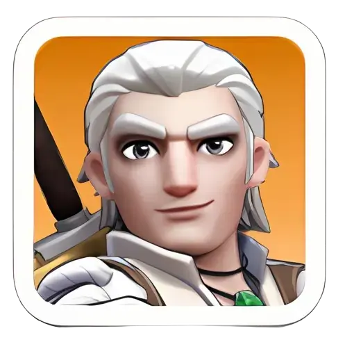
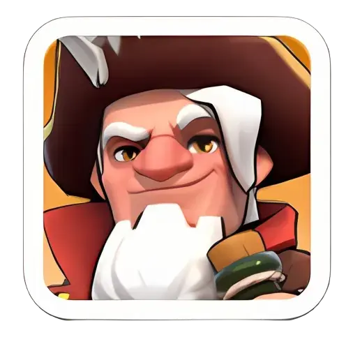
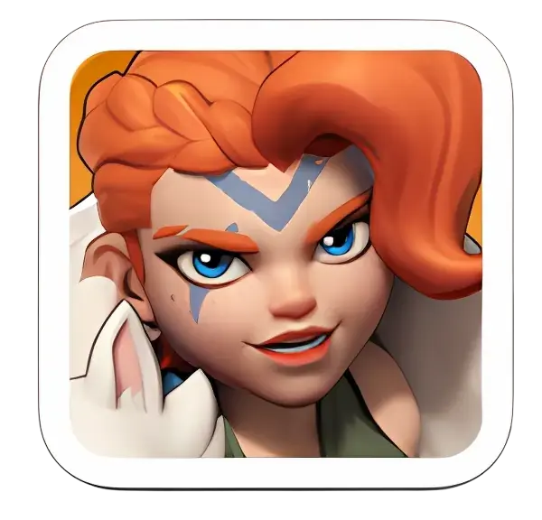
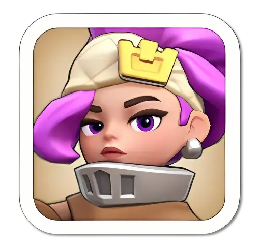

# Hero Investment — Rally Host vs. Rally Joiner vs. Garrison Defense

Which heroes are worth building depends entirely on the role. A hero that's excellent leading a rally can be mediocre defending, and a hero built for defense often has nothing to offer as a joiner. This guide separates the three roles so you invest shards and gear in the right direction.

## Rally Host (Attack Leader)

The hero who **leads** your own rally. Their full stat line, gear, research bonuses, and **all three** of their skills apply — this is the hero the rally's damage ceiling is built around.

**Commonly recommended hosts:**

| Hero | Class | Notes |
|---|---|---|
| **Amadeus**  | Infantry | Only offensive infantry widget available for a long stretch of early-to-mid game — a near-mandatory early host |
| **Petra**  | Archer | Strong early-to-mid rally lead; solid Widget skill for attack multiplier |
| **Marlin**  | — | Reliable rally-lineup and Arena pick |
| **Thrud**  | Cavalry | Boosts mixed Infantry + Archer lineups; becomes the preferred Cavalry lead once unlocked |

**Takeaway:** put your gear, widget upgrades, and star investment into whichever of these fits your available troop lane — this is the hero whose full kit the rally leans on.

---

## Rally Joiner (Helping Someone Else's Attack)

When you **join** a rally, none of your own gear or widget matters, and only your **lead hero's first Expedition skill** is counted. Because of this, joiner value comes down almost entirely to one specific skill effect — usually a flat Lethality or Attack boost.

**Commonly recommended joiners:**

| Hero | Skill Effect | Notes |
|---|---|---|
| **Chenko**  | +25% Squad Lethality | One of the most accessible, best early joiner picks |
| **Amadeus**  | +25% Squad Lethality | Same tier as Chenko as a joiner — see host-vs-joiner note below |
|