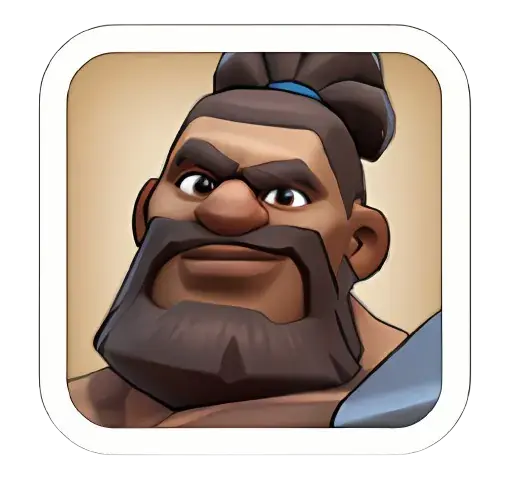
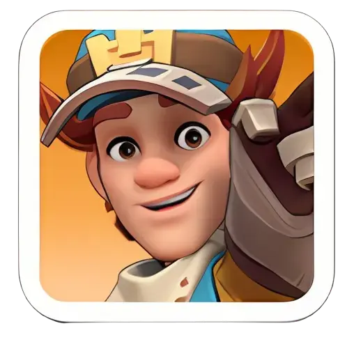
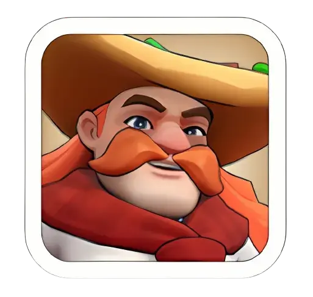

# Hero Investment — Rally Host vs. Rally Joiner vs. Garrison Defense

Which heroes are worth building depends entirely on the role. A hero that's excellent leading a rally can be mediocre defending, and a hero built for defense often has nothing to offer as a joiner. This guide separates the three roles so you invest shards and gear in the right direction.

---

## Why the Same Hero Isn't Good at Everything

Two things decide which role a hero fits:

- **Widget (Exclusive Gear) type** — Rally leads need an *offensive* widget. Garrison defenders need a *defensive* widget. A hero with the wrong widget type for the job underperforms no matter how leveled they are.
- **What actually counts when you're not leading** — When you **join** someone else's rally, only the **lead hero's first Expedition skill** applies. Your Slot 2 and 3 heroes (and everyone else's skills besides the host's first skill) contribute troop capacity only — their own skills are ignored entirely.

This is why a hero can be S-tier as a joiner and only average as a host, or vice versa.

---

## Rally Host (Attack Leader)

The hero who **leads** your own rally. Their full stat line, gear, research bonuses, and **all three** of their skills apply — this is the hero the rally's damage ceiling is built around.

**What to look for:** an offensive Widget, strong base stats for your troop lane (Infantry/Cavalry/Archer), and skills that scale rally-wide damage rather than just their own march.

**Commonly recommended hosts:**

| Hero | Class | Notes |
|---|---|---|
| **Amadeus**  | Infantry | Only offensive infantry widget available for a long stretch of early-to-mid game — a near-mandatory early host |
| **Petra**  | Archer | Strong early-to-mid rally lead; solid Widget skill for attack multiplier |
| **Marlin**  | Archer | Reliable rally-lineup and Arena pick |

**Takeaway:** put your gear, widget upgrades, and star investment into whichever of these fits your available troop lane — this is the hero whose full kit the rally leans on.

---

## Rally Joiner (Helping Someone Else's Attack)

When you **join** a rally, none of your own gear or widget matters, and only your **lead hero's first Expedition skill** is counted. Because of this, joiner value comes down almost entirely to one specific skill effect — usually a flat Lethality or Attack boost.

**Commonly recommended joiners:**

| Hero | Skill Effect | Notes |
|---|---|---|
| **Chenko**  | +25% Squad Lethality | One of the most accessible, best early joiner picks |
| **Amadeus**  | +25% Squad Lethality | Same tier as Chenko as a joiner — see host-vs-joiner note below |
| **Yeonwoo**  | +25% Squad Lethality | Equal tier when properly leveled |
| **Amane**  | Attack boost | Stacks multiplicatively against Lethality-type skills — pair rather than stack many of the same type |

**Heroes to avoid sending as a joiner's lead hero:** Jabel, Gordon, Edwin, Long Fei, Helga, Diana — their first skills are defensive, debuff, or economy-focused and contribute nothing to attack damage. Sending troops with no hero, or a hero whose skill genuinely doesn't apply, is often better than wasting the joiner slot on one of these.

### Host or Joiner? (The Amadeus Case)
Some heroes are strong at both, which raises a real trade-off. Amadeus as a **host** buffs everyone in the one rally he leads. Amadeus as a **joiner** contributes his skill to several different rallies across an event. If you have another well-developed host available (e.g., Helga at 4–5 stars with a solid widget), it's often better to let that hero host and send Amadeus around as a joiner — the combined contribution across multiple rallies can outweigh anchoring him to one. If no one else can host competitively, Amadeus should host.

---

## Garrison Defense

**This is a separate role, not a "defensive host."** Rally hosting and garrison defense aren't two versions of the same job — you don't "lead" a defense the way you lead a rally. Garrison heroes are simply **assigned to hold** a structure (your city or an alliance structure) against incoming attacks. You want a **defensive widget**, high durability/sustain, and skills that debuff attackers or reduce incoming damage.

**Worth knowing:** when your garrison is attacked, the game doesn't just use whoever holds the "Garrison Captain" tag — it automatically pulls stats from the **single defender inside with the highest overall stats** and uses those for the whole defense. Alliance leaders can reshuffle this by relieving a captain (pushing them to the bottom of the list), which lets you deliberately promote whichever member's hero skills are actually strong for defense.

**Commonly recommended defenders:**

| Hero | Class | Notes |
|---|---|---|
| **Jabel**  | Cavalry | Early, accessible defender widget — reduces damage taken for all squads |
| **Zoe**  | Infantry | One of the best long-term F2P defensive investments; stays relevant many generations |
| **Howard**  | Infantry | The only Epic Infantry hero in Generation 1. Highest Health of any non-Legendary hero (26,640) — higher than Jabel or Saul — but modest Attack. Best used as a durable garrison wall, not a damage source |
| **Saul**  | Archer | Solid early garrison defender on his own, but his real strength is as a **stacked garrison joiner** — see below |
| **Gordon**  | Infantry | Called out specifically for Infantry Health-based defense alongside Saul and Eric — *this one is less verified than the others above; only one source confirms it, so treat it as a reasonable early pick rather than a settled ranking* |
| **Hilde**  | Cavalry | Solid defensive pick; double-effect skill also makes her a strong garrison joiner |

### Garrison Joiner Stacking (Different from Bear Hunt Joining)

This is a separate mechanic from Bear Hunt joining, worth not confusing with it. When you send a hero to **join** an ally's garrison (rather than defend your own city), certain heroes get stronger the more copies of them are stacked together in that garrison.

**Saul is the standout example:** stacking 4 copies of Saul as garrison joiners produces a strong SkillMod boost — noticeably better than using him as your own primary defender. If your alliance coordinates who joins which garrison, put your Saul(s) toward a stack rather than holding one back to defend solo.

---

## Quick Reference

| Your Goal | Invest In |
|---|---|
| Leading your own attack rally | Amadeus, Petra, Marlin |
| Joining someone else's rally | Chenko, Amadeus, Yeonwoo, Amane |
| Defending your city / alliance structures | Zoe, Jabel, Howard, Gordon, Hilde |
| Joining an ally's garrison (stacking) | Saul (4x stack) |

**Solo attacks (no rally) and Alliance Championship are the exception** — Widget type stops mattering there, and raw base stats plus skill synergy decide the outcome instead. A hero with a defensive widget can outperform a rally specialist in that specific context.
